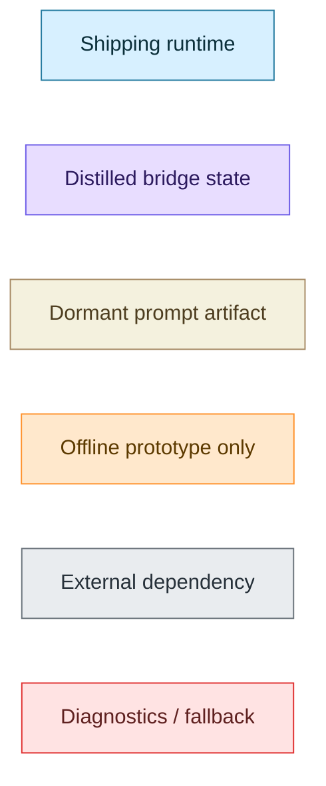
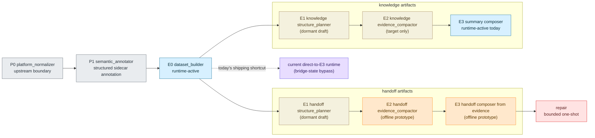

# Export / Distilled-Handoff Mermaid Architecture

Status: Active diagram companion  
Audience: Prompt engineers, runtime engineers, domain experts, release owners

## Purpose

这份文档是 Vesti 导出功能与 distilled handoff 机制的**图解入口**。

它不替代现有的架构说明文档，而是把当前 export 体系拆成：
- 一张总图
- 三张分层图

这样可以更快回答下面几类问题：
- 当前 `Full / Compact / Summary` 到底怎么走
- `Compact` 为什么现在等价于 distilled handoff
- proxy、LLM、diagnostics、fallback 在导出链路里各自扮演什么角色
- `P1 -> E1 -> E2 -> E3` 为什么现在还是原型/目标态，而不是 shipping runtime

如需 prose-first 版本，请继续阅读：
- [export_ai_handoff_architecture.md](./export_ai_handoff_architecture.md)
- [export_prompt_contract.md](./export_prompt_contract.md)

## How To Read

- 先看“总图”，建立全局地图
- 再看“当前 shipping export runtime”，确认现在真正在线运行的路径
- 再看“distilled handoff bridge state”，理解当前 compact/default handoff 的真实机制
- 最后看“target decomposition”，理解未来为什么要拆到 `P0 -> P1 -> E0 -> E1 -> E2 -> E3 -> repair`

## Legend

图例语义固定：
- `runtime`: 当前 shipping runtime 里真实会跑到的节点
- `bridge`: 当前 distilled handoff bridge state 的关键节点
- `dormant`: 已定义但未接入 runtime 的 prompt / stage artifact
- `prototype`: 只在离线原型或验证链路里使用
- `external`: proxy / model / 上游依赖
- `diagnostic`: validation、warning、continuation、fallback 等辅助机制

## Overview

```mermaid
flowchart LR
  subgraph UI["用户导出入口"]
    Full["Full"]:::runtime
    Compact["Compact<br/>默认 distilled handoff"]:::bridge
    Summary["Summary<br/>frozen shipping path"]:::runtime
  end

  Export["exportConversations.ts"]:::runtime
  Serialize["serializers / file output"]:::runtime
  Compression["exportCompression.ts"]:::runtime
  CompactPrompt["compactComposer.ts<br/>distilled execution state"]:::bridge
  SummaryPrompt["summaryComposer.ts"]:::runtime
  Proxy["vesti-proxy<br/>proxy_max_tokens"]:::external
  LLM["Kimi / Step"]:::external
  Validate["validation + diagnostics"]:::diagnostic
  Continue["bounded continuation"]:::diagnostic
  Fallback["deterministic handoff fallback<br/>(diagnostic-only)"]:::diagnostic
  Prototype["offline prototype<br/>P1 -> E1 -> E2 -> E3"]:::prototype

  Full --> Export
  Compact --> Export
  Summary --> Export

  Export -->|"full"| Serialize
  Export -->|"compact"| Compression
  Export -->|"summary"| Compression

  Compression -->|"compact"| CompactPrompt
  Compression -->|"summary"| SummaryPrompt

  CompactPrompt --> Proxy --> LLM --> Validate
  SummaryPrompt --> Proxy

  Validate -->|"valid"| Serialize
  Validate -.->|"incomplete_output_risk"| Continue --> Proxy
  Validate -.->|"fallback"| Fallback --> Serialize

  CompactPrompt -.->|"future layered path"| Prototype

  classDef runtime fill:#d7f0ff,stroke:#247ba0,color:#0b2f3a,stroke-width:1px;
  classDef bridge fill:#e8ddff,stroke:#6c5ce7,color:#2d1b5f,stroke-width:1px;
  classDef dormant fill:#f4f1de,stroke:#a68a64,color:#4d3d1f,stroke-width:1px;
  classDef prototype fill:#ffe8cc,stroke:#ff922b,color:#5c3a00,stroke-width:1px;
  classDef external fill:#e9ecef,stroke:#6c757d,color:#27313a,stroke-width:1px;
  classDef diagnostic fill:#ffe3e3,stroke:#e03131,color:#5f2120,stroke-width:1px;
```

这张图解释的是整个 export 体系的总关系。

现在用户仍然从统一导出入口进入：
- `Full` 直接走本地序列化
- `Compact` 默认进入 distilled handoff 路线
- `Summary` 保持 frozen shipping path

真正负责 compact/summary LLM 路由的是 `exportCompression.ts`。对 `Compact` 来说，当前关键变化不是“再加一个用户切换器”，而是 compact 自身已经默认成为 distilled handoff。proxy 与 LLM 是外部依赖；validation、continuation、diagnostic-only fallback 则是桥接状态下的可靠性机制。离线 `P1 -> E1 -> E2 -> E3` 原型已经存在，但它还没有接入当前 shipping runtime。

当前最大的治理边界是：runtime 已经具备 distilled-handoff 的 bridge state 能力，但 layered decomposition 还没有真正 runtime 化。

## 图 1：当前 Shipping Export Runtime

```mermaid
flowchart LR
  subgraph Entry["当前用户入口"]
    Full1["Full"]:::runtime
    Compact1["Compact<br/>默认 distilled handoff"]:::bridge
    Summary1["Summary"]:::runtime
  end

  Dataset["E0 dataset_builder<br/>exportConversations.ts"]:::runtime
  Serialize1["toMarkdown / toText / toJson"]:::runtime
  Compression1["exportCompression.ts"]:::runtime
  CompactRoute["distilled handoff route"]:::bridge
  SummaryRoute["summary shipping route"]:::runtime
  CompactComposer["compactComposer.ts"]:::bridge
  SummaryComposer["summaryComposer.ts"]:::runtime
  Proxy1["vesti-proxy"]:::external
  Llm1["Kimi / Step"]:::external
  Notice["notice / warning / JSON diagnostics"]:::diagnostic
  LocalFallback["local fallback"]:::diagnostic

  Full1 --> Dataset
  Compact1 --> Dataset
  Summary1 --> Dataset

  Dataset -->|"full"| Serialize1
  Dataset -->|"compact"| Compression1
  Dataset -->|"summary"| Compression1

  Compression1 --> CompactRoute --> CompactComposer
  Compression1 --> SummaryRoute --> SummaryComposer

  CompactComposer --> Proxy1 --> Llm1 --> Notice
  SummaryComposer --> Proxy1
  Notice -.-> LocalFallback
  Notice --> Serialize1
  LocalFallback --> Serialize1

  classDef runtime fill:#d7f0ff,stroke:#247ba0,color:#0b2f3a,stroke-width:1px;
  classDef bridge fill:#e8ddff,stroke:#6c5ce7,color:#2d1b5f,stroke-width:1px;
  classDef dormant fill:#f4f1de,stroke:#a68a64,color:#4d3d1f,stroke-width:1px;
  classDef prototype fill:#ffe8cc,stroke:#ff922b,color:#5c3a00,stroke-width:1px;
  classDef external fill:#e9ecef,stroke:#6c757d,color:#27313a,stroke-width:1px;
  classDef diagnostic fill:#ffe3e3,stroke:#e03131,color:#5f2120,stroke-width:1px;
```

这张图只解释**现在真正在线运行**的 export 路径。

真实 shipping runtime 里，入口仍然是 `exportConversations.ts` 这个 `E0 dataset_builder`。`Full` 不进入压缩/蒸馏路径；`Compact` 现在默认进入 distilled handoff；`Summary` 仍然保持旧的 summary shipping route。这里最需要强调的是：当前产品已经不再让普通用户手动选择 `Current / Experimental`，而是让 `Compact` 直接承载 distilled handoff。

这张图里没有 `E1/E2`，因为它们还不是 runtime-active。当前最大的质量瓶颈也不在入口层，而在 compact 路线进入 proxy / LLM 后的生成质量、warning、fallback 和 token-cap 依赖。

## 图 2：Distilled Handoff Bridge State

```mermaid
flowchart LR
  Input["selected threads + ordered messages"]:::runtime
  Packing["evidence-window packing<br/>first 4 + middle windows + last 12"]:::bridge
  Prompt["compactComposer.ts<br/>distilled execution state"]:::bridge
  Proxy2["vesti-proxy<br/>proxy_max_tokens"]:::external
  Llm2["LLM completion"]:::external
  Validate2["structural + integrity validation"]:::diagnostic
  Continue2["bounded continuation"]:::diagnostic
  Fallback2["deterministic handoff fallback<br/>(diagnostic-only)"]:::diagnostic

  Header["StartedAt + Conversation Type"]:::bridge
  Overview["## State Overview"]:::bridge
  Sections["conditional whitelist sections"]:::bridge
  Output["delivered handoff.md / .json"]:::runtime
  Diag["JSON diagnostics<br/>finish_reason / usage / proxy_max_tokens"]:::diagnostic

  Input --> Packing --> Prompt --> Proxy2 --> Llm2 --> Validate2

  Validate2 -->|"valid draft"| Header --> Overview --> Sections --> Output
  Validate2 --> Diag

  Validate2 -.->|"incomplete_output_risk"| Continue2 --> Proxy2
  Validate2 -.->|"invalid / too short"| Fallback2 --> Output
  Output --> Diag

  classDef runtime fill:#d7f0ff,stroke:#247ba0,color:#0b2f3a,stroke-width:1px;
  classDef bridge fill:#e8ddff,stroke:#6c5ce7,color:#2d1b5f,stroke-width:1px;
  classDef dormant fill:#f4f1de,stroke:#a68a64,color:#4d3d1f,stroke-width:1px;
  classDef prototype fill:#ffe8cc,stroke:#ff922b,color:#5c3a00,stroke-width:1px;
  classDef external fill:#e9ecef,stroke:#6c757d,color:#27313a,stroke-width:1px;
  classDef diagnostic fill:#ffe3e3,stroke:#e03131,color:#5f2120,stroke-width:1px;
```

这张图解释的是**当前 compact/default handoff 的真实机制**，也就是所谓的 bridge state。

核心特征有四个：
- 输入不是盲目全文，而是经过 evidence-window packing
- 输出合同不再是纯 heading compliance，而是 `StartedAt`、`Conversation Type`、`## State Overview` 加 conditional whitelist sections
- 质量保障依赖 validation、`incomplete_output_risk` 检测和 bounded continuation
- deterministic fallback 还在，但它已经被明确降级为 diagnostic-only，不是 expert-facing primary artifact

这条桥接路线已经能给出更像 handoff 的产物，但它仍然没有把 extraction 压力前移到 `E1/E2`。当前最大的质量边界仍然是：它本质上还是 `E3` 里的一条强化路线，而不是完整的 layered runtime。

## 图 3：Target Decomposition

这张图解释的是未来的目标态：为什么大家一直在讨论 `P0 -> P1 -> E0 -> E1 -> E2 -> E3 -> repair`。

关键点有三个：
- `P0/P1` 是 export 之前的上游边界，不是 prompt stage 本身
- `E1/E2` 是 shared stage slots，但 handoff 与 knowledge 采用 separate prompt artifacts
- 当前 shipping runtime 其实仍然绕过了 `E1/E2`，从 `E0` 直接进入当前 `E3`/bridge-state 路线

所以这张图不是“现在已经这样运行”，而是“当前 bridge state 正在朝哪里演进”。最大的治理边界是：只有当 `E1/E2` 真正接入 runtime 之后，`E3` 才能从 one-shot distillation 进一步收缩成纯 composer。

## Cross-Document Notes

- prose-first 主文档：  
  [export_ai_handoff_architecture.md](./export_ai_handoff_architecture.md)
- contract / artifact / inventory：  
  [export_prompt_contract.md](./export_prompt_contract.md)  
  [export_prompt_inventory.md](./export_prompt_inventory.md)
- pre-`E0` 边界：  
  [cross_platform_conversation_normalization_architecture.md](./cross_platform_conversation_normalization_architecture.md)
- 原型说明：  
  [../engineering_handoffs/2026-03-18-export-distillation-prototype.md](../engineering_handoffs/2026-03-18-export-distillation-prototype.md)

## Reading Outcome

如果读者只看这份 Mermaid 文档，应该能够回答：
- 当前 export 的实际入口和运行时主链是什么
- 为什么 `Compact` 现在等价于 distilled handoff
- `Summary` 为什么保持冻结
- proxy 为什么会影响 handoff 质量
- 当前 bridge state 和未来 layered decomposition 的边界到底在哪里
